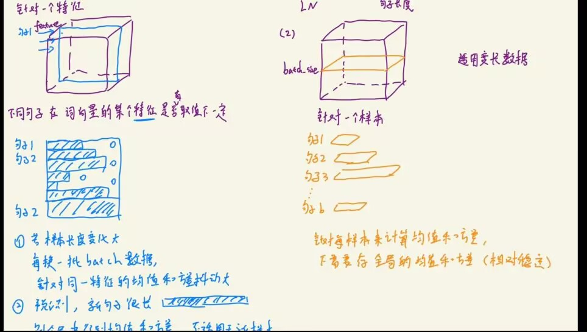
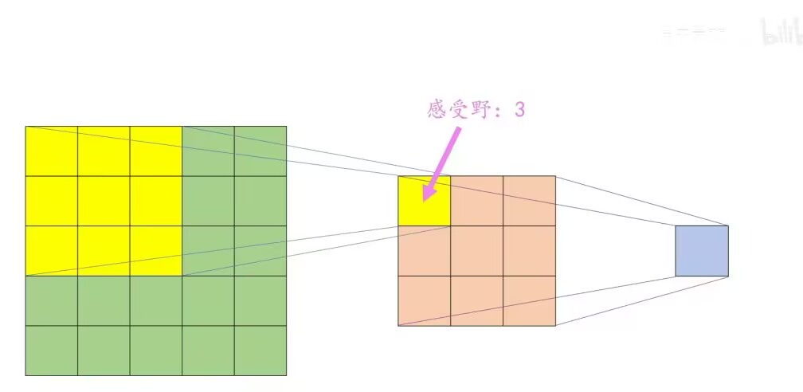

##### 1.我们经常看到 with torch.no_grad(): 和 model.eval() 这两行代码。请问：它们的作用分别是什么？如果在做Inference时，只写了 model.eval() 而没有写 torch.no_grad()：

-  `with torch.no_grad()` ：关闭梯度计算，不构建计算图，节省显存占用和计算开销
-   `model.eval()`：将模型切换到评估模式，关闭 Dropout、固定 BatchNorm 的统计量，确保推理行为正确

- 会影响计算结果吗？
  - 一般不会改变前向输出，但如果没有`torch.no_grad()`，PyTorch仍然会追踪张量的梯度，可能导致计算图的构建，进而导致梯度不稳定并进行额外计算
  
- 会影响显存占用吗？
  - 会显著增加，尤其是处理大批次数据时，会记录大量中间张量和梯度

##### 2.在 PyTorch 的训练 Loop 中，通常顺序是：optimizer.zero_grad() -> loss.backward() -> optimizer.step()。请问：如果我们不小心漏掉了 optimizer.zero_grad()，直接进行下一轮 backward()，模型参数的梯度 w.grad 会发生什么变化？（是被覆盖？还是被累加？）这种机制在什么特定的训练场景下是有用的？
 - `optimizer.zero_grad()`负责清零梯度，如果漏掉的话梯度会自动累加，而不是覆盖原有梯度
 - 有用场景：当显容不足以容纳一个大批次数据的时候，可以把大批次数据拆分成多个小批次，依次计算小批次梯度并累加来获得大批次训练的效果

##### 3.假设我们将神经网络的所有权重参数Weights都初始化为常数 1。请问：在反向传播时，同一层的所有神经元学到的Gradient会有什么关系？这对模型的学习能力有什么致命影响？
- 同一层所有神经元的在反向传播得到梯度会完全相同，导致它们的权重更新完全一致，相当于一层只有一个独立神经元
- 模型退化为简单线性变换，无法拟合复杂非线性任务，学习复杂特征。

##### 4.SGD在遇到“峡谷”形状的损失曲面时容易震荡。为了解决这个问题，我们引入了动量Momentum。请描述：动量是如何帮助优化器加速收敛并抑制震荡的？
动量的核心思想是给优化器加一个“惯性”：
它会把之前多轮的梯度方向也考虑进来，而不是只看当前这一步的梯度。当梯度在峡谷两侧来回晃时，动量会把这些反向的梯度“平滑掉”，让优化器更稳地沿着峡谷谷底（也就是损失下降最快的方向）往前走，而不是来回跳。如果连续多轮梯度方向一致，动量会让更新的步子越来越大，相当于“加速”冲向最优解，让收敛更快

##### 5.学习率Learning Rate是炼丹中最关键的超参数之一。如果学习率设置得过大，Loss 曲线通常会出现什么现象？如果学习率设置得过小，模型训练又会面临什么问题？
- 学习率过大：
模型更新步伐太大，在最优解附近左右跳跃，Loss 曲线会剧烈震荡，甚至越训练越差（发散），很难稳定收敛
- 学习率过小：
每一步只前进一点点，训练进度极慢，还容易停在局部最优，长时间看不到 Loss 明显下降

##### 6.在训练模型时，我们不仅要看训练集 Loss，更要关注验证集（Validation Set）Loss。场景A：训练Loss持续下降且数值很低（模型在训练集上表现完美），但验证 Loss 却先降后升，两者差距越来越大。这是发生了什么现象？场景B：训练 Loss和验证Loss都居高不下，无论怎么训练都降不下去。这是发生了什么现象？对策：针对场景A过拟合，请列举几种除了“增加更多数据”以外的有效缓解手段。
- 场景 A（训练 Loss 很低，验证 Loss 先降后升）：
这是**过拟合**。模型过于注重训练集里的噪声、细节，导致泛化性很差，在新数据上反而表现不好
​
- 场景 B（训练 Loss 和验证 Loss 都降不下去）：
这是**欠拟合**。模型太简单，连训练集的规律都没学会，更别说泛化了
​
- 过拟合对策：
​
- 加 Dropout 层，随机忘记一些神经元，防止模型过度依赖某些特征
​
- 用 L1/L2 正则化，给权重加惩罚，让模型不要学习太极端的权重
​
- 早停（Early Stopping），看到验证 Loss 开始上升就立刻停训
​
- 数据增强，比如图片翻转、裁剪，让训练数据更多样丰富
​
- 减小模型容量，比如减少层数或神经元数量

##### 7.在深度网络中，如果使用 Sigmoid 或 Tanh 作为激活函数，很容易出现梯度消失问题。请从这两个函数的导数图像/最大值角度，解释为什么梯度会消失？ReLU 激活函数是如何解决这个问题的？
- Sigmoid/Tanh 梯度消失：
这两个函数的导数在一般情况下都小于1（Sigmoid导数最大0.25，Tanh导数最大1），多层叠起来后，梯度会一层一层衰减，传到前面几层时几乎变成0，参数就无法更新了
- ReLU 怎么解决：
ReLU在正区间导数恒为1，梯度不会衰减；负区间导数为0，梯度为0，这样梯度就能顺畅地往前传，避免了消失问题

##### 8.虽然 ReLU 解决了梯度消失，但它有一个被称为 Dying ReLU 的问题。这是指神经元进入了什么状态？一旦进入这个状态，该神经元的梯度会变成多少？它还有可能“复活”被更新吗？

- 状态：神经元对所有输入的输出都是0，进入“死亡”状态
- 梯度：梯度恒为0，权重再也不会更新
- 复活：几乎不可能，除非学习率特别大，且后续输入恰好让它重新激活

##### 9.在 PyTorch 中，做多分类任务通常直接使用 nn.CrossEntropyLoss，它的输入是未归一化的 Logits，而不是经过 Softmax 后的概率。为什么 PyTorch 建议不要先手动写 Softmax 再传给 Loss，而是直接把 Logits 传进去？（提示：从 Log-Sum-Exp 的数值稳定性角度考虑）

- 手动先算 Softmax 再传 Log，会遇到数值问题：当 Logits 很负时，Softmax 输出接近 0，再取 Log 就会变成 -inf，导致计算溢出或精度丢失
- PyTorch 内部用 Log-Sum-Exp 技巧，把 Softmax 和 Log 合并成一步计算，避免了数值溢出，更稳定：
$$
\text{CrossEntropy}(z, y) = -\frac{1}{N}\sum_{i=1}^N \left[ z_{y_i} - \log\left(\sum_{j=1}^K e^{z_j}\right) \right]
$$
 
 

##### 10.Dropout 在训练时以概率 $p$ 随机丢弃神经元。假设训练时 $p=0.5$（即丢弃 50%）。为了保证测试阶段和训练阶段输出的期望值保持一致，我们在测试阶段需要对权重或输出做什么操作？（或者反过来，PyTorch 在训练阶段做了什么？）
- 训练时：以 50% 概率丢弃神经元，输出期望减半。
- 测试时：PyTorch 会自动把权重乘以 0.5（或者在训练时对保留的神经元输出乘以 2），保证训练和测试时输出的期望一致，结果才稳定。
 

##### 11.Batch Normalization（BN）和Layer Normalization（LN）是深度学习中最常用的两种归一化手段。请用通俗的语言描述：它们在计算均值和方差的维度上有什么核心区别？为什么在 Transformer（NLP 任务）中通常优先使用 LN，而在 ResNet（CV 任务）中通常优先使用 BN？

- BN（Batch Normalization）：
按“批次”归一化，对同一通道、不同样本算均值和方差。比如一张图片的同一个通道，在一批图片里做归一
- LN（Layer Normalization）：
按“样本”归一化，对同一样本、所有通道算均值和方差。比如对一句话里所有词的所有特征做归一
- Transformer 用 LN：
NLP 里句子长度变化大，批次里的样本统计不稳定，LN 对单样本归一更靠谱
- ResNet 用 BN：
CV 里批次样本统计稳定，BN 能利用跨样本的统计信息，让训练更稳、泛化更好

##### 12.在卷积神经网络（CNN）中，假设我们连续堆叠了 3 个 $3 \times 3$ 的卷积层（Stride=1, Padding=0）。请问：第 3 层输出特征图上的一个像素点，在最原始的输入图像上，能看到多大的区域（即感受野 Receptive Field 是多少）？

- 第 1 层：3×3
  第 2 层：3 + (3-1) = 5×5
  第 3 层：5 + (3-1) = 7×7
  最终感受野是 7×7，也就是输出图上一个点，对应原图上 7×7 的区域

  