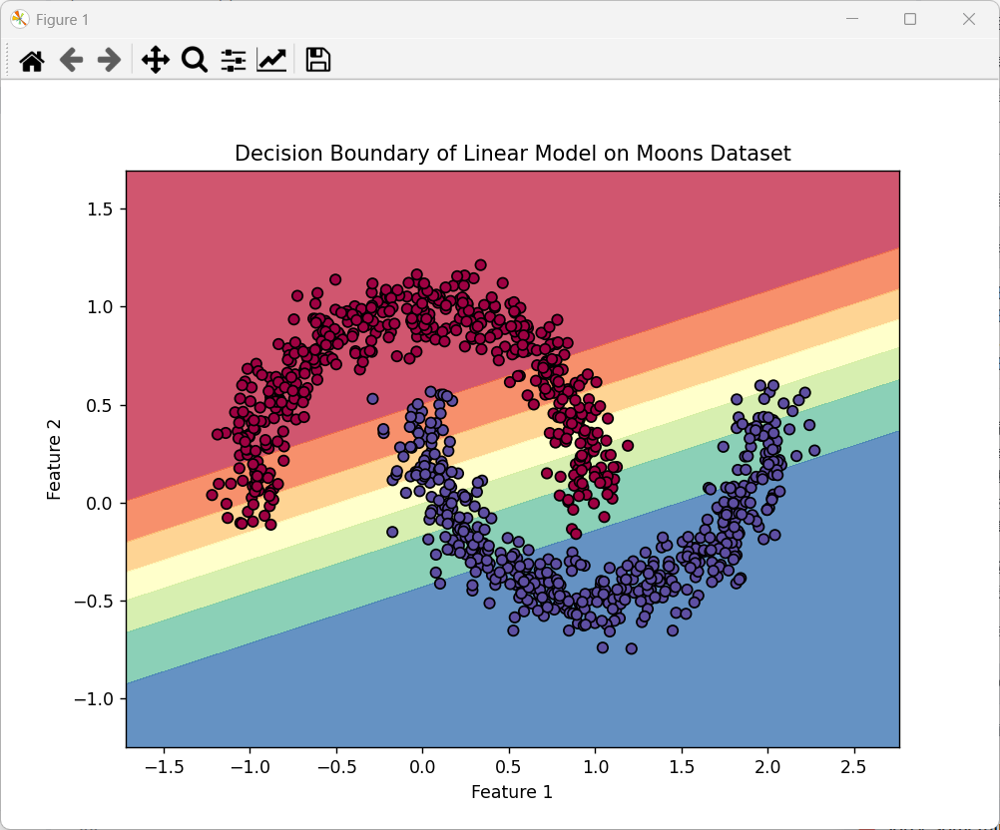

##### 1. 线性模型的局限性
​
- 没有隐藏层的网络本质上是一个线性分类器，只能学习线性可分的决策边界（一条直线）
​
- 双月（moons）数据集是典型的非线性可分数据，因此线性模型无法正确分类，决策边界会是一条直线，无法“围绕”两个半月形
​
##### 2. 为什么神经网络需要隐藏层
​
- 隐藏层（尤其是带非线性激活的）让网络具备了拟合复杂非线性边界（如双月等数据集）的能力
​
- 没有隐藏层的线性模型，无法处理非线性可分的问题