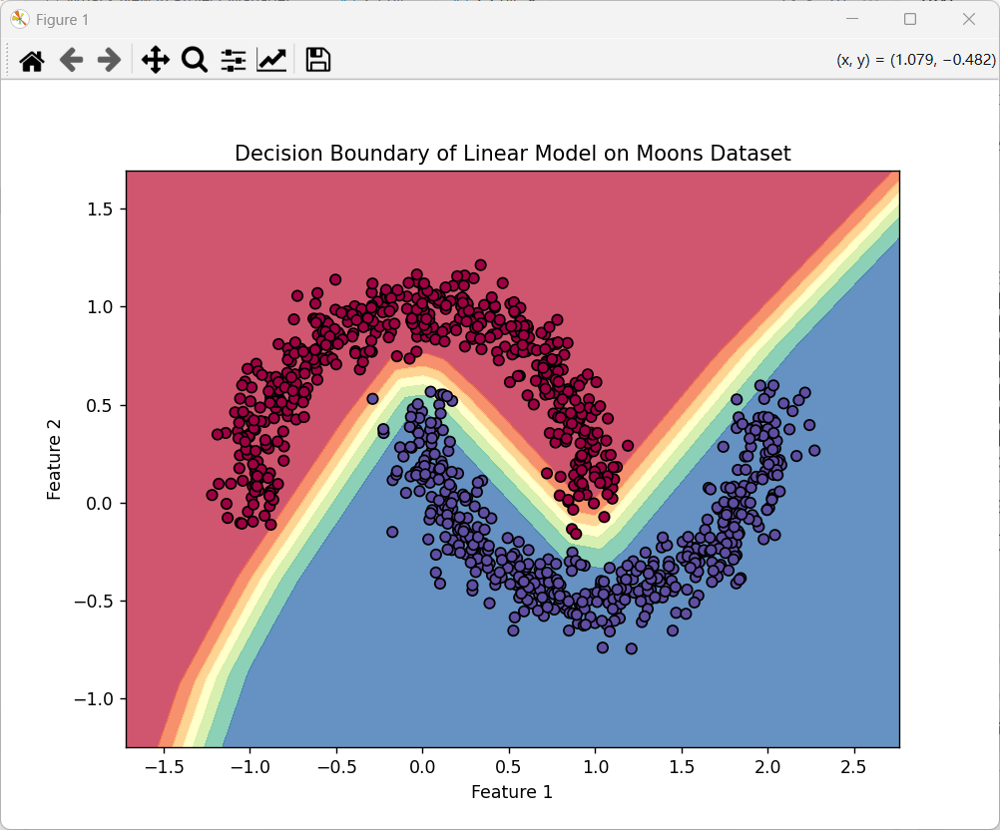

##### 1.加入隐藏层的效果
- 加入隐藏层和非线性激活后，模型不再是简单的线性分类器，而是可以拟合复杂的非线性决策边界
​
- 双月数据集的两个半月形，现在可以被一条“弯曲”的边界很好地分开，这直观展示了非线性激活函数是神经网络具备强大表达能力的关键所在

##### 2.关于层数的思考

**如果我们在任务 2.2 中去掉了所有的激活函数（ReLU/Tanh），哪怕我把神经网络堆叠到 100 层深，每一层有 1000 个神经元。请问：这个深层网络的数学表达能力，比起任务 2.1 中的单层网络，有本质提升吗？为什么？**

- 没有本质提升
 
  多层全连接但没有激活函数，本质上仍然是一个线性变换：
$$
y = W_n W_{n-1} \dots W_1 x + b'
$$

  多个矩阵相乘的结果仍然是一个矩阵，多个偏置相加的结果仍然是一个偏置
​
  无论堆叠多少层、每层多少神经元，整个网络的数学表达能力，都等价于一个单层线性网络，依然只能画直线，无法处理非线性可分问题

##### 3.关于折线的观察

**如果你使用的是 ReLU 作为激活函数，请仔细观察任务 2.2 中画出来的决策边界。你会发现这条“曲线”其实是由许多微小的直线段拼接而成的，而不是绝对光滑的曲线。这是由 ReLU 的什么特性导致的？**

- 这是由 ReLU 的分段线性特性导致的
 
  ReLU 函数是分段线性的：
$$
\text{ReLU}(x) = \max(0, x)
$$

  每一层的 ReLU 会把输入空间划分成多个线性区域，多层叠加后，决策边界就表现为由许多微小直线段拼接而成的“折线”，而不是光滑曲线

