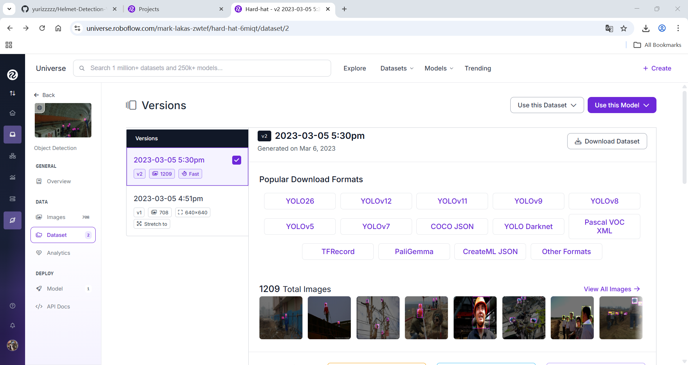
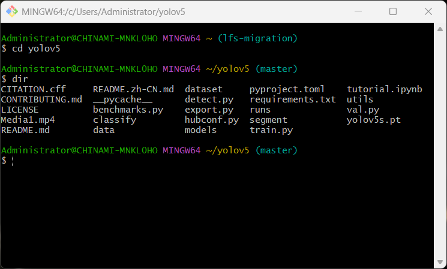
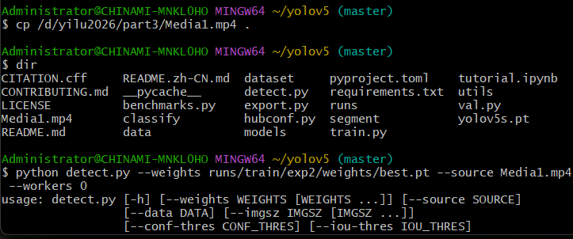
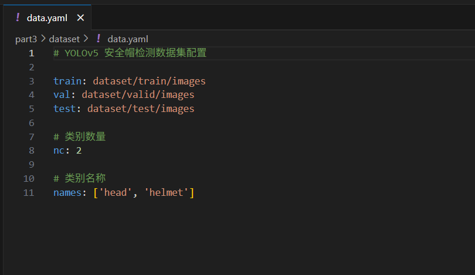

# YOLO 目标检测

## 实验结果

### 数据集准备


*从 Roboflow 上下载的数据集示例*

### 模型训练


*训练过程截图*

### 训练视频


*训练过程视频截图*

### 数据集配置


*data.yaml 配置文件截图*

## 核心问题解答

### 1. 目标检测的基本原理

- **目标检测任务**：目标检测不仅要识别图像中的物体类别，还要精确定位物体的位置（通常用边界框表示）
- **YOLO 算法**：You Only Look Once，将目标检测问题转化为单一的回归问题，通过一个神经网络直接预测边界框坐标和类别概率
- **优势**：速度快，适用于实时应用，同时保持较高的检测精度

### 2. 数据集准备的重要性

- **数据标注**：准确的标注是模型训练的基础，包括边界框坐标和类别标签
- **数据增强**：通过旋转、缩放、翻转等操作增加数据多样性，提高模型泛化能力
- **数据集划分**：通常分为训练集、验证集和测试集，用于模型训练、评估和测试

### 3. 模型训练过程

- **损失函数**：YOLO 使用复合损失函数，包括边界框回归损失、类别预测损失和置信度损失
- **优化器**：通常使用 Adam 或 SGD 优化器
- **学习率调度**：采用余弦退火等策略调整学习率，提高训练效果
- **训练评估**：定期在验证集上评估模型性能，保存最佳模型

## 代码实现细节

### 数据集配置

```yaml
# data.yaml 配置文件
train: ../train/images
val: ../valid/images
test: ../test/images

nc: 1  # 类别数量
names: ['object']  # 类别名称
```

### 模型训练命令

```bash
# 训练命令
yolo train data=data.yaml model=yolov8n.pt epochs=50 batch=16 imgsz=640
```

### 模型评估

```bash
# 评估命令
yolo val data=data.yaml model=runs/detect/train/weights/best.pt
```

### 模型推理

```bash
# 推理命令
yolo predict model=runs/detect/train/weights/best.pt source=test.jpg
```

## 技术要点

1. **YOLO 网络结构**
   - 采用 Darknet 作为骨干网络，提取图像特征
   - 使用特征金字塔网络（FPN）融合多尺度特征
   - 输出层直接预测边界框坐标、置信度和类别概率

2. **数据预处理**
   - 图像 resize 到统一尺寸
   - 归一化处理
   - 数据增强（随机裁剪、翻转、旋转等）

3. **后处理**
   - 非极大值抑制（NMS）：过滤重叠边界框
   - 置信度阈值：过滤低置信度预测


