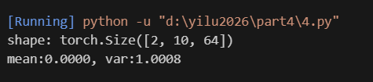

# Transformer 自注意力机制

## 实验结果

### 自注意力机制可视化



## 核心问题解答

### 1. Mask 机制的原理

**问题**：在实现 Mask 机制时（比如为了不让模型看见未来的词，或者屏蔽掉 Padding 的空位置），我们通常的操作是：`scores = scores.masked_fill(mask == 0, -1e9)` 即将被 Mask 的位置填为一个极小的负数（负无穷）。为什么我们不直接把这些位置乘以 0？

- 如果直接把被Mask的位置乘以0，那么这些位置的score会变成 0，代入Softmax公式：
  $$
  S_i = \frac{e^{x_i}}{\sum_j e^{x_j}}
  $$
  当 $x_i$ = 0 时，$e^{0}$ = 1，这会导致这些位置仍然有一定的注意力权重，无法真正屏蔽

- 如果把这些位置的score设为极小的负数（如 -1e9，近似于负无穷），则 $e^{-1e9} \approx$ 0，Softmax 后这些位置的权重几乎为0，模型就完全不会关注它们，就可以实现真正的屏蔽

### 2. Q、K、V 的意义

**问题**：在 Self-Attention 中，输入 $X$ 明明都是同一个词向量序列，为什么我们要大费周章地用三个不同的线性变换矩阵（$W_Q, W_K, W_V$）把它映射成 $Q$（Query）、$K$（Key）、$V$（Value）？假设：如果我们不进行映射，直接让 $Q=X, K=X, V=X$，然后去算 $Attention(X, X, X) = \text{softmax}(XX^T)X$，这在逻辑上会有什么局限性？

- 如果直接让 $Q=X, K=X, V=X$，自注意力就退化成：
  $$
  \text{Attention}(X,X,X) = \text{softmax}\left(\frac{XX^\top}{\sqrt{d_k}}\right)X
  $$

- **局限性**：
  1. 没有经过 $W_q, W_k, W_v$ 映射，$Q、K、V$ 就完全相同，模型无法学习到“查询-键-值”的差异，只能做固定的相似度加权，无法捕捉复杂的语义关系
  2. 三者是 $X$ 通过不同线性层变化得到，三个线性层是可以独立学习的，不同的任务可以学习不同的参数，如果不分离，就相当于放弃了这一层的学习
  3. 将三者进一步拆分为多个头的时候，每个头有三个不同子空间，用于捕捉不同类型的关系，如果仅采用 $X$ 一个，就无法灵活地进行多头的拆分和组合

### 3. 点积的几何视角

**问题**：Self-Attention 的核心公式里有一个 $Q \cdot K^T$（点积）。两个向量的点积（Dot Product）在几何上代表了什么关系？当一个词的 Query 向量和另一个词的 Key 向量点积很大时，意味着这两个词在语义空间中处于什么状态？

- 两个向量的点积表示它们在空间的方向的相似性，当一个词的 Query 向量和另一个词的 Key 向量点积很大时，意味着这两个词在语义空间中距离很近、高度相关,从而模型会给这个 Key 对应的 Value 分配更高的注意力权重，更“关注”这个词

### 4. 缩放因子的作用

**问题**：公式里有一个不起眼的除法：$\frac{QK^T}{\sqrt{d_k}}$。如果不除以这个数，当 $d_k$（向量维度）非常大时，点积的结果数值会变得很大。这时候再过 Softmax 函数，会导致梯度发生什么现象？

  - 如果不除以 $\sqrt{d_k}$，当 $d_k$ 很大时，点积 $QK^\top$ 的结果会变得非常大
  - Softmax 函数大输入非常敏感，输出的注意力权重会极度集中在少数几个最大值上，对其他较小输出几乎没有关注
  - 这会导致 Softmax 的梯度几乎为 0（梯度消失），反向传播时几乎没有梯度更新，模型无法有效训练
  - 除以 $\sqrt{d_k}$ 是为了把点积的方差控制在 1 左右，让 Softmax 输出更平滑，梯度更稳定，避免梯度消失

## 代码实现细节

### 自注意力机制实现

```python
import torch
import torch.nn as nn

class SelfAttention(nn.Module):
    def __init__(self, embed_dim, num_heads):
        super(SelfAttention, self).__init__()
        self.embed_dim = embed_dim
        self.num_heads = num_heads
        self.head_dim = embed_dim // num_heads
        
        # 线性变换层
        self.q_linear = nn.Linear(embed_dim, embed_dim)
        self.k_linear = nn.Linear(embed_dim, embed_dim)
        self.v_linear = nn.Linear(embed_dim, embed_dim)
        self.out_linear = nn.Linear(embed_dim, embed_dim)
        
        self.scale = torch.sqrt(torch.FloatTensor([self.head_dim]))
    
    def forward(self, x, mask=None):
        batch_size, seq_len, embed_dim = x.shape
        
        # 线性变换
        q = self.q_linear(x)
        k = self.k_linear(x)
        v = self.v_linear(x)
        
        # 多头拆分
        q = q.view(batch_size, seq_len, self.num_heads, self.head_dim).permute(0, 2, 1, 3)
        k = k.view(batch_size, seq_len, self.num_heads, self.head_dim).permute(0, 2, 1, 3)
        v = v.view(batch_size, seq_len, self.num_heads, self.head_dim).permute(0, 2, 1, 3)
        
        # 计算注意力分数
        scores = torch.matmul(q, k.permute(0, 1, 3, 2)) / self.scale
        
        # 应用掩码
        if mask is not None:
            mask = mask.unsqueeze(1).unsqueeze(2)
            scores = scores.masked_fill(mask == 0, -1e9)
        
        # 计算注意力权重
        attention = torch.softmax(scores, dim=-1)
        
        # 加权求和
        output = torch.matmul(attention, v)
        
        # 多头合并
        output = output.permute(0, 2, 1, 3).contiguous()
        output = output.view(batch_size, seq_len, self.embed_dim)
        
        # 最终线性变换
        output = self.out_linear(output)
        
        return output, attention
```

### 掩码实现

```python
def create_mask(seq_len, device):
    # 创建上三角掩码，用于屏蔽未来的词
    mask = torch.tril(torch.ones(seq_len, seq_len)).to(device)
    return mask

# 使用示例
seq_len = 5
device = torch.device('cuda' if torch.cuda.is_available() else 'cpu')
mask = create_mask(seq_len, device)
print(mask)
```

### 多头注意力可视化

```python
import matplotlib.pyplot as plt
import seaborn as sns

def visualize_attention(attention, tokens):
    # 可视化注意力权重
    plt.figure(figsize=(10, 8))
    sns.heatmap(attention, xticklabels=tokens, yticklabels=tokens, cmap='viridis')
    plt.title('Attention Weights')
    plt.tight_layout()
    plt.show()

# 使用示例
tokens = ['[CLS]', 'Hello', 'world', '!', '[SEP]']
# 假设 attention 是形状为 (seq_len, seq_len) 的注意力权重矩阵
visualize_attention(attention[0, 0].detach().cpu().numpy(), tokens)
```

## 技术要点

1. **自注意力机制**
   - 通过计算序列中每个元素与其他元素的注意力权重，捕捉长距离依赖关系
   - 不需要递归或卷积操作，并行计算效率高
   - 适用于处理变长序列数据

2. **多头注意力**
   - 将注意力机制分为多个头，每个头关注不同的特征子空间
   - 提高模型的表达能力，捕捉多种类型的关系
   - 增强模型的泛化能力

3. **位置编码**
   - 由于自注意力机制本身不包含位置信息，需要添加位置编码
   - 通常使用正弦和余弦函数生成位置编码
   - 使模型能够区分不同位置的相同词

4. **前馈网络**
   - 自注意力层后接前馈网络，进一步处理注意力输出
   - 包含两个线性层和一个非线性激活函数
   - 增强模型的非线性表达能力

5. **层归一化**
   - 在每一层的输入处应用层归一化
   - 加速模型收敛，提高训练稳定性
