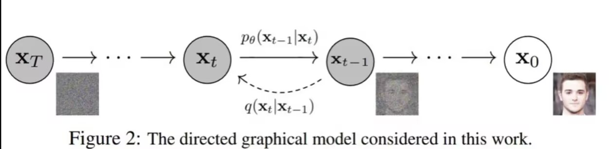
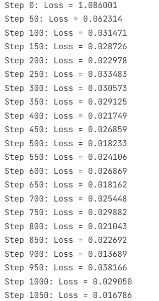
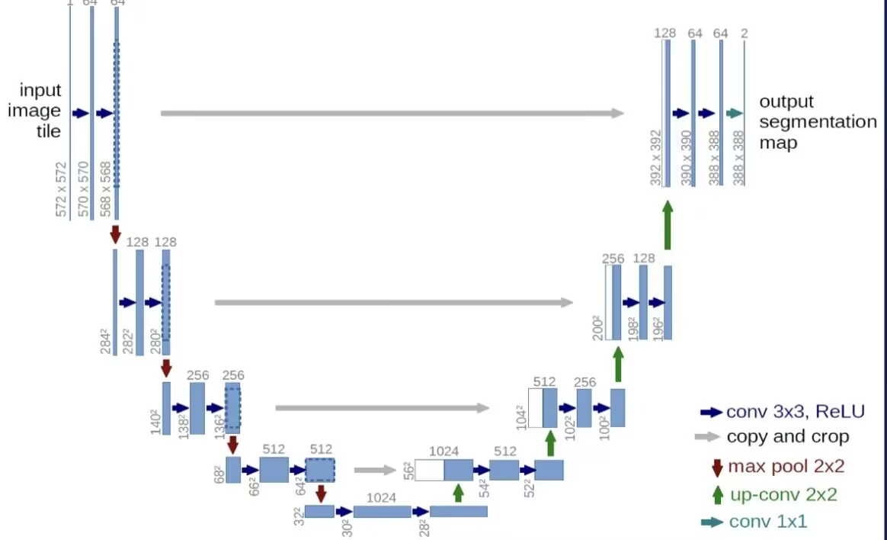

# 扩散模型 (Diffusion Model)

## 论文导读问题

### 1关于前向过程

**论文中定义了一个固定的加噪过程。请问：随着时间步t的增加（从 0 到 T），图像$x_t$的分布会逐渐趋近于什么分布？为什么这个性质对于生成过程至关重要？**

- 随着时间步t的增加，图像$x_t$的分布会逐渐趋近于标准正态分布（N(0, I)）。
- 这个性质对于生成过程至关重要，因为它允许我们从一个简单的标准正态分布开始（$$x_T$$），通过逐步逆向去噪过程，最终生成有意义的图像（$x_0$）。如果 $x_T$ 不是一个简单的已知分布，我们就无法找到公式一次算出去噪后结果。


**实现**：
- 噪声调度器的初始化：定义了 beta 从 0.0001 到 0.02 的线性增长，确保最终噪声分布接近标准正态分布。
```python
beta_schedule = LinearBetaSchedule(
    beta_start=0.0001,
    beta_end=0.02,
    num_train_steps=1000,
)
```
- 加噪过程：根据时间步逐渐添加噪声。
```python
noisy_images = noise_scheduler.add_noise(images, timesteps)
```

### 2关于逆向过程

**我们神经网络是为了模拟逆向过程。论文指出，为了从 $x_t$ 还原出 $x_{t-1}$，神经网络本质上是在预测什么？（是预测原图$x_0$？还是预测该步加入的噪声 $\epsilon$？亦或是预测均值 $\mu$？）**

- 神经网络本质上是在预测该步加入的噪声$\epsilon$。
- 噪声预测比预测原图或均值更稳定和容易。通过预测噪声，我们可以通过 $x_t$ 计算出 $x_{t-1}$，然后根据 $x_{t-1}$ 计算出 $x_{t-2}$，以此类推，直到还原出 $x_0$。(因为是线性变换，所以可以推导公式，从 $x_T$ 一次计算出 $x_0$。公式为：$x_0 = \frac{x_t - \sqrt{1 - \alpha_t} \cdot \epsilon_\theta(x_t, t)}{\sqrt{\alpha_t}}$)
**实现**：
- 噪声调度器配置：设置 `prediction_type="epsilon"`，明确指定预测目标为噪声。
- 噪声预测：模型接收带噪图像和时间步，输出预测的噪声$\epsilon$。
```python
epsilon_pred = model(noisy_images, timesteps)
```
- 损失计算：使用 MSE 损失函数比较预测噪声$\epsilon_(pred)$与真实噪声$\epsilon$。

### 关于网络输入

**为什么在输入图片$x_t$ 的同时，还必须把当前的时间步 t（Time Step）告诉神经网络？如果不输入 t，网络在处理$x_t$（微小噪声）和$x_T$（巨大噪声）的图片时会遇到什么逻辑矛盾？**

- 必须把时间步t告诉神经网络，因为不同时间步的噪声水平不同，网络需要根据当前噪声水平调整其预测方法。
- 如果不输入t，网络无法区分微小噪声（t接近0）和巨大噪声（t接近T）的图片。对于微小噪声的图片，网络应该只做轻微的去噪；而对于巨大噪声的图片，网络需要做大量的去噪。没有时间步信息，网络无法做出正确的判断，会导致使用不合适的方法去噪。

**实现**：
- 模型输入：模型接收带噪图像和时间步，输出预测的噪声$\epsilon$。
- 时间步采样：随机采样时间步，确保网络在训练中接触到各种噪声水平的样本。
```python
timesteps = torch.randint(0, T, (batch_size,))
```
   

## 代码实现说明

### 1 数据准备  

**任务**：加载 MNIST 数据集并进行预处理，确保输入数据归一化到 [-1, 1] 之间。

**实现代码**：
```python
def get_dataloader(dataset_name='mnist', batch_size=128, image_size=32):

    # 定义图像预处理管道
    transform = transforms.Compose([
        transforms.Resize((image_size, image_size)),  # 调整图像大小
        transforms.ToTensor(),  # 转换为张量
        transforms.Lambda(lambda x: (x * 2) - 1)  # 归一化到[-1, 1]范围
    ])
    
    # 加载MNIST数据集
    dataset = load_dataset("mnist", split="train")
   
    # 预处理函数
    def preprocess(examples):
        # 处理每张图像，确保是灰度图
        images = [transform(image.convert("L") if image.mode != "RGB" else image) 
                 for image in examples["image"]]
        return {"pixel_values": images}
    
    # 设置数据集的预处理函数
    dataset.set_transform(preprocess)
    
    # 自定义数据批处理函数
    def collate_fn(examples):
        # 堆叠图像张量
        images = torch.stack([example["pixel_values"] for example in examples])
        # 转换为连续内存格式并转换为float类型
        images = images.to(memory_format=torch.contiguous_format).float()
        return {"images": images}
    
    # 创建并返回数据加载器
    return DataLoader(
        dataset, 
        batch_size=batch_size,  # 批次大小
        shuffle=True,  # 打乱数据
        collate_fn=collate_fn,  # 批处理函数
        num_workers=0  # 禁用多进程
    )
```

### 2 构建扩散模型

**任务**：构建包含噪声调度和 UNet 风格网络的扩散模型。

**实现代码**：
```python
def setup_model_and_scheduler(image_size=32, in_channels=1, device="cuda"):

    # 初始化UNet模型
    model = UNet2DModel(
        sample_size=image_size,           # 图片尺寸
        in_channels=in_channels,          # 输入通道数
        out_channels=in_channels,         # 输出通道数
        layers_per_block=2,               # 每个残差块的层数
        block_out_channels=(128, 256, 512, 512),  # 各层的通道数配置
        down_block_types=(                # 下采样块类型
            "DownBlock2D",        # 普通下采样块
            "DownBlock2D", 
            "AttnDownBlock2D",    # 带注意力机制的下采样块
            "AttnDownBlock2D",
        ),
        up_block_types=(                  # 上采样块类型
            "AttnUpBlock2D",      # 带注意力机制的上采样块
            "AttnUpBlock2D",
            "UpBlock2D", 
            "UpBlock2D", 
        ),
    )
    # 将模型移到指定设备
    model.to(device)
    
    # 初始化噪声调度器
    noise_scheduler = DDPMScheduler(
        num_train_timesteps=1000,  # 总时间步数
        beta_start=0.0001,         # beta起始值
        beta_end=0.02,             # beta结束值
        beta_schedule="linear",    # 调度策略
        variance_type="fixed_small",  # 方差类型
        prediction_type="epsilon"  # 预测目标：噪声
    )
    
    return model, noise_scheduler
```

### 3 训练  

**任务**：实现论文中的训练算法，包括随机采样干净图片和时间步、生成随机高斯噪声、生成带噪图片、让网络预测噪声、计算损失。

**实现代码**：
```python
def train_one_epoch(model, noise_scheduler, optimizer, dataloader, device="cuda"):

    # 设置模型为训练模式
    model.train()
    total_loss = 0  # 总损失
    
    # 遍历数据加载器
    for step, batch in enumerate(dataloader):
        # 获取干净图像并移到指定设备
        clean_images = batch["images"].to(device)
        batch_size = clean_images.shape[0]  # 批次大小
        
        # 随机采样时间步
        timesteps = torch.randint(
            0, noise_scheduler.config.num_train_timesteps, 
            (batch_size,), device=device
        ).long()  # 转换为长整型
        
        # 添加噪声 (Diffusers库）
        noise = torch.randn_like(clean_images)  # 生成与图像形状相同的噪声
        noisy_images = noise_scheduler.add_noise(clean_images, noise, timesteps)  # 添加噪声
        
        # 预测噪声
        noise_pred = model(noisy_images, timesteps, return_dict=False)[0]  # 预测噪声
        
        # 计算损失 - MSE损失
        loss = F.mse_loss(noise_pred, noise)  # 预测噪声与真实噪声的均方误差
        
        # 反向传播
        optimizer.zero_grad()  # 清零梯度
        loss.backward()  # 计算梯度
        torch.nn.utils.clip_grad_norm_(model.parameters(), 1.0)  # 梯度裁剪，防止梯度爆炸
        optimizer.step()  # 更新参数
        
        total_loss += loss.item()  # 累加损失
        
        # 每100步打印进度
        if step % 100 == 0:
            print(f"Step {step}: Loss = {loss.item():.4f}")
    
    # 返回平均损失
    return total_loss / len(dataloader)
```

### 4 采样与生成

**任务**：实现逆向去噪算法，从标准正态分布采样纯噪声，经过T步迭代，最终生成图片。

**实现代码**：
```python
@torch.no_grad()  # 禁用梯度计算，节省内存
def generate_images(model, noise_scheduler, num_images=16, image_size=32, in_channels=1, device="cuda"):

    # 设置模型为评估模式
    model.eval()
    
    # 创建pipeline
    pipeline = DDPMPipeline(
        unet=model,
        scheduler=noise_scheduler
    )
   
    pipeline.to(device)
    
    # 生成图片
    images = pipeline(
        batch_size=num_images,  # 批量生成数量
        generator=torch.Generator(device=device).manual_seed(42)  # 固定随机种子，保证可重复性
    ).images
    
    # 转换格式: PIL Image -> numpy array
    images_np = np.stack([np.array(img) for img in images])
    
    return images_np

@torch.no_grad()  # 禁用梯度计算
def create_denoising_animation(model, noise_scheduler, num_steps=50, device="cuda"):

    # 设置模型为评估模式
    model.eval()
    
    # 生成初始噪声
    batch_size = 1  # 批大小为1
    image_size = 32  # 图像尺寸
    in_channels = 1  # 输入通道数
    
    # 生成初始噪声
    noise = torch.randn(
        (batch_size, in_channels, image_size, image_size),
        device=device
    )
    
    # 存储每一步的结果      
    images = []  # 存储去噪过程的图片
    x = noise.clone()  # 初始化为噪声
    
    # 逐步去噪      
    # 生成时间步列表，从大到小
    timesteps = list(reversed(range(0, noise_scheduler.config.num_train_timesteps, 
                                   noise_scheduler.config.num_train_timesteps // num_steps)))
    
    # 遍历每个时间步
    for i, t in enumerate(timesteps):
        # 构建时间步张量
        timestep = torch.tensor([t] * batch_size, device=device)
        
        # 预测噪声
        noise_pred = model(x, timestep, return_dict=False)[0]
        
        # 使用调度器计算前一步
        x = noise_scheduler.step(
            noise_pred, t, x, generator=None
        ).prev_sample
        
        # 转换为PIL图片
        if i % 5 == 0 or i == len(timesteps) - 1:  # 每5步保存一次，最后一步也要保存
            img = x.squeeze().cpu().numpy()  # 移除batch维度并移到CPU
            img = np.clip((img + 1) * 127.5, 0, 255).astype(np.uint8)  # 转换为0-255范围
            images.append(Image.fromarray(img))  # 添加到列表
        
        # 打印进度
        print(f"去噪进度: {i+1}/{len(timesteps)}")
    
    #保存为GIF
    images[0].save(
        "denoising_process.gif",  # 保存文件名
        save_all=True,  # 保存所有帧
        append_images=images[1:],  # 后续帧
        duration=100,  # 每帧100ms
        loop=0  # 无限循环
    )
    print("去噪动画已保存为: denoising_process.gif")
    
    return images
```

## 实验结果

### 1 Loss变化

训练过程中，Loss在第前50个epoch左右，Loss大幅下降，然后就一直在0.1-0.4之间波动。


### 2 可视化

#### 1 网格图

生成了16个数字的网格图，这些数字清晰可辨，说明经过训练后模型的生成能力较好。

#### 2 去噪过程动画

创建了去噪过程的GIF动画，动画展示了一张图片从“满屏雪花点”（纯噪声）一步步变化的过程，直观地展示了扩散模型的工作原理和去噪过程。但是最后也没能生成清晰的数字，可能是模型训练不足？？

## 技术要点

1. **U 型对称编码器-解码器结构**
 
- 编码器（下采样）：通过卷积和池化逐步压缩图像尺寸，提取多尺度空间特征，同时保留细节信息。
- 解码器（上采样）：通过转置卷积逐步恢复图像尺寸，并与编码器对应层的特征进行跳跃连接，有效避免信息丢失，精准恢复图像细节。


 
1. **注意力机制**
 
- 在 UNet 的中间层或瓶颈处引入注意力模块，让模型能关注图像中关键区域，捕捉长距离依赖关系，提升对复杂结构和细节的生成能力。
 
1. **时间步编码**

- 将时间步t编码为向量，注入到UNet的每一层中，使网络能感知当前噪声水平，动态调整去噪方式，适应不同阶段的图像状态。
- 通常通过正弦位置编码或可学习嵌入层实现，让模型理解“现在是第几步去噪”。
 
4. **残差连接**
 
- 在卷积块内部使用残差连接，缓解深层网络训练时的梯度消失问题，让模型可以训练得更深，同时稳定训练过程。
 
5. **噪声预测任务适配**
- 输入为带噪图像 $x_t$ 和时间步 $t$，输出为预测噪声 $\epsilon_\theta$，而非直接预测原图或均值，通过噪声计算损失函数，实现对图像的去噪。